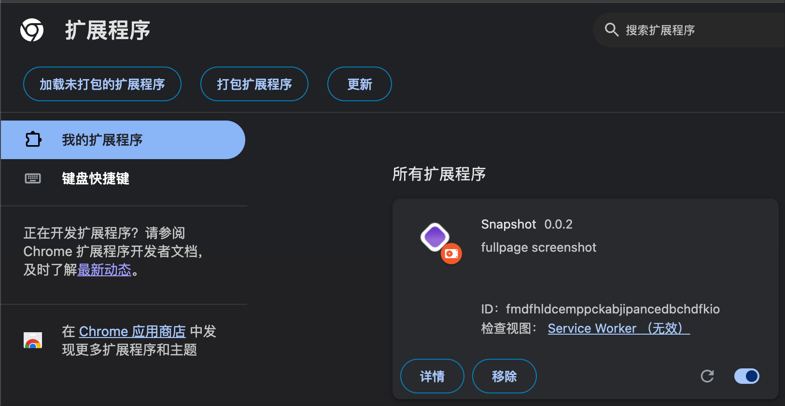

# Snapshot 浏览器长截图扩展（Chrome MV3 / Plasmo）

本项目基于 Plasmo 构建，实现稳定的整页长截图：预处理页面样式 → 分段截图 → 画布拼接 → 一键下载。

## 实现思路（架构概览）
- 后台统一驱动流程（避免消息丢失）：
  - 在页面环境中注入脚本进行预处理（chrome.scripting.executeScript）：
    - 记录并备份每个受影响元素的 `style.cssText`、页面 `scrollTop`、`overflow`。
    - 固定元素（position: fixed）：设置 `visibility:hidden`、`pointer-events:none`，避免固定在整图顶部。
    - 粘性元素（position: sticky）：临时设置 `position:static; top:auto; z-index:auto`，取消吸附但保留占位。
    - 隐藏滚动条（`body { overflow: hidden }`）。
  - 分段截图：按视口高度逐屏滚动，加入基础延时 + 指数退避重试，使用 `chrome.tabs.captureVisibleTab` 获取截图。
  - 图片拼接：`OffscreenCanvas` 按总高度合并；“最后一屏”仅从底部裁剪，避免重复区域。
  - 下载：将最终 `Blob` 转 `data URL`，通过 `chrome.downloads.download` 触发保存（MV3 环境不依赖 `URL.createObjectURL`）。
- 关键实现参考：
  - 预处理/滚动/恢复与拼接逻辑见 [background.ts](./background.ts)
  - 内容脚本仅作备份，当前方案不依赖 [content.ts](./content.ts)

## 使用步骤
1. 安装依赖（首次）
   - `pnpm i`
2. 构建产物（打包）
   - `pnpm build`
3. 在浏览器导入 build 产物（Chrome）
   - 打开 `chrome://extensions`，开启“开发者模式”。
   - 点击“加载已解压的扩展程序”，选择 build 目录中的 chrome-mv3 对应产物目录。
   - 参考截图：

   

4. 试用
   - 打开任意网页，点击扩展图标，在弹窗中点击“开始截图”。
   - 等待处理完成，浏览器将自动下载整页截图（PNG）。

## 常见说明与限制
- 为规避截图频率限制（MAX_CAPTURE_VISIBLE_TAB_CALLS_PER_SECOND），已内置基础延时与指数退避重试。
- 若页面使用复杂布局（如虚拟滚动、iframe 深层嵌套），可能需要增大基础延时或改进步进策略。
- 对由父容器触发的粘性布局（祖先为 `sticky`）已做通用处理；若遇到特例，可在后台预处理处增加定制选择器。

## 相关文档
- 技术方案与问题记录见 [instruction.md](./instruction.md)

## 致谢
- 基于 Plasmo 框架构建。
